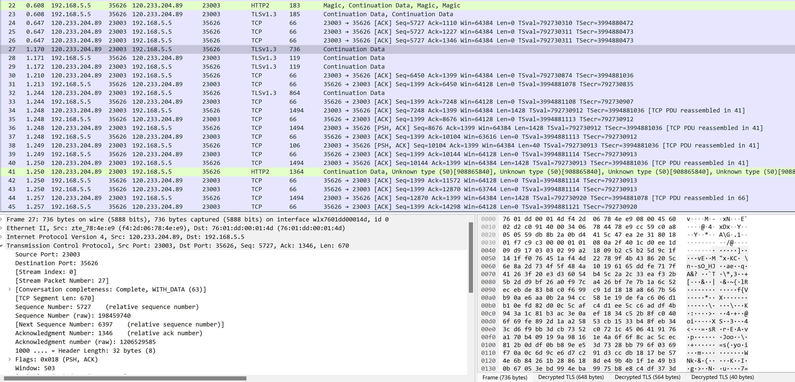
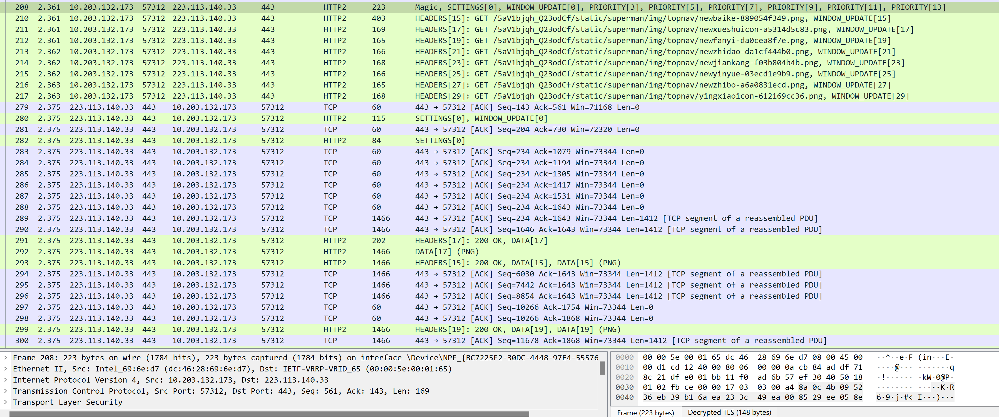
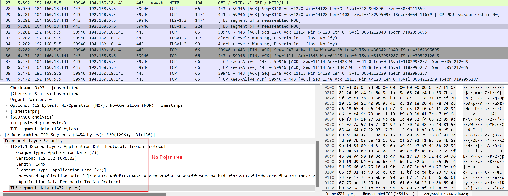
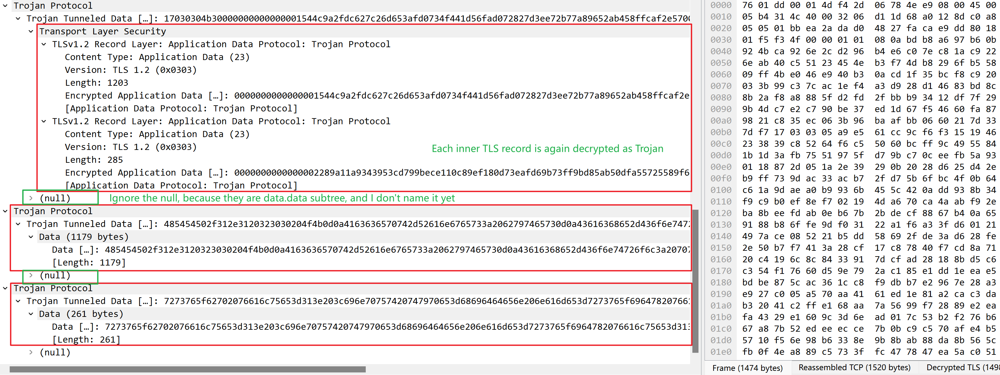

I have upload related [markdown with images](https://github.com/wesly2000/Wireshark-LuaPlugin/blob/main/troubleshooting/CallingTLS/calling-tls-give-wrong-dissection.md), 
the related [Lua code](https://github.com/wesly2000/Wireshark-LuaPlugin/blob/main/trojan.lua) 
and related capture files ([HTTP/1.1](https://github.com/wesly2000/Wireshark-LuaPlugin/blob/main/data/trojan-http-1.1.pcapng) and 
[HTTP/2](https://github.com/wesly2000/Wireshark-LuaPlugin/blob/main/data/trojan-http2.pcapng)) on Github, and these 
captures are injected with TLS secrets for both outer TLS and inner HTTPS payload, 
you could check it if it's convenient.:)

I have solved the `Lua Error: "...wireshark\epan\proto.c:7992: failed assertion "fixed_item->parent == tree"` by manually create a new subtree. According to your answer that `TLS session is stored in a conversation created using the addresses, ports, and port types`, I tried to use different `port_type` defined in `address.h`:

    Dissector.get("tls"):call(tvb, pktinfo, tunnel_tree)
	    if f_data() ~= nil then  
		    local data_tvb = f_data().range:tvb()  <-- Manually create a new tvb by using decrypted data.data field
		    local app_tree = tunnel_tree:add(pf_TLS_app_data, data_tvb)  
		    local save_inner_port_type = pktinfo.port_type  
		    pktinfo.port_type = _EPAN.PT_SCTP  <-- Another new value other than PT_TCP and PT_NONE
		    local save_inner_can_desegment = pktinfo.can_desegment  
		    pktinfo.can_desegment = 2  
		    Dissector.get("http"):call(data_tvb, pktinfo, app_tree)  
	end
	
	pktinfo.port_type = save_port_type  
	pktinfo.can_desegment = save_can_desegment

It seems that the dissector could recognize the first packet of HTTP/2, but can't reassemble the whole HTTP/2 
connection. Instead, the remaining packets belonging to the connection are seen as `Continuation Data` or 
`Unknown Type`:

Compare with the dissections when no tunnel is enabled:

For HTTP/1.1 things get more weird to me, such method seems to violate the saved TLS conversation state
and the Trojan tree disappears again:

Therefore, I also tried the method below, which does not override the `pktinfo.port_type`:

    Dissector.get("tls"):call(tvb, pktinfo, tunnel_tree)

    pktinfo.port_type = save_port_type
    pktinfo.can_desegment = save_can_desegment

    if f_data() ~= nil then
        local data_tvb = f_data().range:tvb()
        local app_tree = tunnel_tree:add(pf_TLS_app_data, data_tvb)
        Dissector.get("http"):call(data_tvb, pktinfo, app_tree)
    end

But there are many `Continuation Data`, which seems also the sign of failing to reassemble TLS.

**One more issue** is that I found the HTTP payload will first be dissected as Trojan tunneled data,
i.e., if the frame contains several TLS records inside the TLS tunnel, when I decrypt the inner
TLS using another keylogfile (I've _injected_ TLS secrets for the outer TLS), each inner TLS record
will be dissected again as Trojan tunneled data, as shown below:

which I don't quite understand.

I've read the Lua dissector on [WireGuard](https://github.com/Lekensteyn/wireguard-dissector/blob/master/wg.lua),
which also leverages tunnel, but since it is based on UDP, I can't apply its method to mine well.

I wonder if I misunderstand your concept of `saving conversation`, or I extend your code in a wrong way.
Any suggestion is appreciated.:)