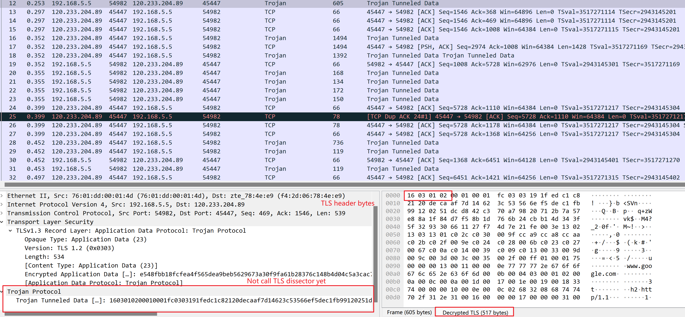
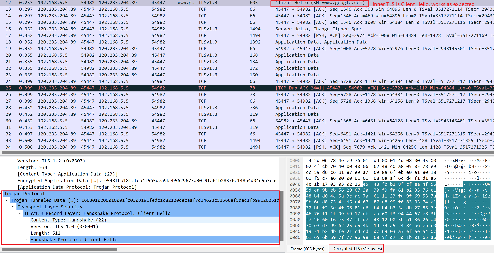
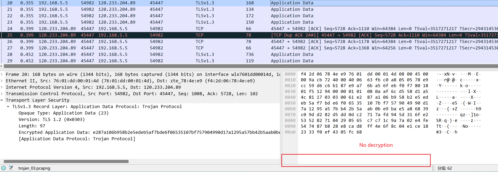

When try to dissect Trojan, which leverages TLS to tunnel HTTPS traffic (i.e., HTTPS-over-TLS), it would be
convenient to call built-in TLS dissector once the outer TLS was successfully decrypted.
This doc uses _Frame 12_ and _Frame 20_ to illustrate the problem encountered.

Before calling TLS Lua dissector, the dissection tree for _Frame 12_ looks like below:

and that for _Frame 20_ looks like below:

When calling built-in TLS Lua dissector for the inner HTTPS packet, the first
several TLS handshaking packets are dissected as expected, as shown below:

However, when it encounters inner TLS Application Data packets, the total
dissection fails, and even the decryption does not work:

